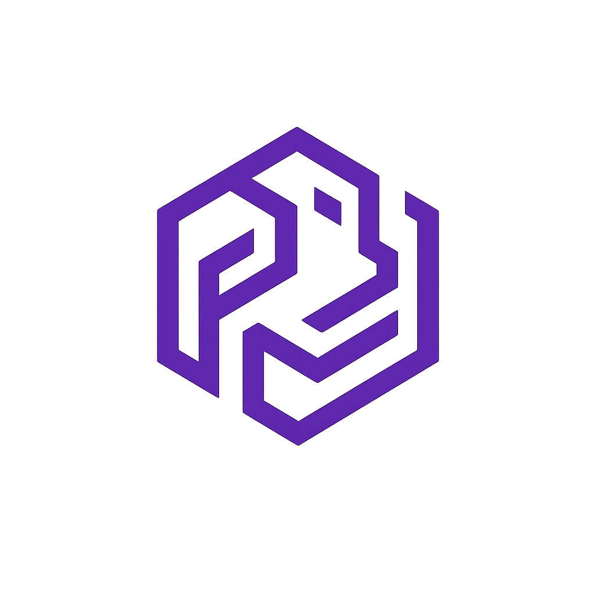

<h1 align="center" style="color:#6A4BBC; font-weight:600;">🛡️ Omnixys User Service – Identity & Security Module</h1>

<p align="center">
  <picture>
    <source media="(prefers-color-scheme: dark)" srcset="public/omnixys-bg-dark.png" />
    <source media="(prefers-color-scheme: light)" srcset="public/omnixys-bg-dark.png" />
    
  </picture>
</p>

<p align="center" style="font-size:16px;">
  <em style="color:#6A4BBC; font-weight:500;">The Fabric of Modular Innovation</em>
</p>

---

<h2 align="center" style="color:#6A4BBC; font-weight:600;">📊 Repository Status</h2>

<p align="center" style="font-size:14px; color:#312E81;">
  Continuous Integration, Deployment & Security Overview for the <strong>Omnixys User Service</strong>.
</p>

<!-- CI/CD Status Table -->
<table align="center" style="border-collapse:collapse;">
  <tr>
    <th colspan="2" align="center" style="padding:6px; color:#4E3792;">⚙️ CI / CD Pipeline</th>
  </tr>
  <tr>
    <td align="center" style="padding:4px;">
      
    </td>
    <td align="center" style="padding:4px;">
      
    </td>
  </tr>
  <tr>
    <td align="center" style="padding:4px;">
      
    </td>
    <td align="center" style="padding:4px;">
      <a href="./.extras/badges/coverage.svg">
        
      </a>
    </td>
  </tr>

   <tr>
    <td align="center" style="padding:4px;">
      
    </td>
   <td align="center" style="padding:4px;">
      
    </td>
  </tr>
    <tr>
      <td align="center" style="padding:4px;">
      
    </td>
     <td align="center" style="padding:4px;">
      
    </td>
    </tr>
</table>

<!-- Repository Metrics -->
<table align="center" style="border-collapse:collapse;">
  <tr>
    <th colspan="2" align="center" style="padding:6px; color:#4E3792;">📈 Repository Metrics</th>
  </tr>
  <tr>
    <td align="center" style="padding:4px;">
      
    </td>
    <td align="center" style="padding:4px;">
      
    </td>
  </tr>
  <tr>
    <td align="center" style="padding:4px;">
      
    </td>
    <td align="center" style="padding:4px;">
      
    </td>
  </tr>
  <tr>
    <td align="center" style="padding:4px;">
      
    </td>
    <td align="center" style="padding:4px;">
      
    </td>
  </tr>
  <tr>
    <td align="center" style="padding:4px;">
      <a href="./LICENSE.md">
        
      </a>
    </td>
    <td align="center" style="padding:4px;">
      <a href="./SECURITY.md">
        
      </a>
    </td>
  </tr>
  <tr>
    <td align="center" style="padding:4px;">
      
    </td>
    <td align="center" style="padding:4px;">
      <a href="https://omnixys.com">
        
      </a>
    </td>
  </tr>
</table>

---

<h2 align="center" style="color:#6A4BBC; font-weight:600;">📖 Table of Contents</h2>

<p align="center" style="font-size:14px; color:#312E81;">
  Dual-language navigation for this repository documentation.<br/>
  <strong>English | Deutsch</strong>
</p>

<p align="center" style="font-size:15px;">
  <b>
    <a href="#english-version" style="color:#4E3792; text-decoration:none;">🇬🇧 English Version</a> |
    <a href="#deutsche-version" style="color:#4E3792; text-decoration:none;">🇩🇪 Deutsche Version</a>
  </b>
</p>

<table align="center" style="border-collapse:collapse; font-size:14px;">
  <thead>
    <tr style="color:#4E3792;">
      <th style="padding:6px 12px;">🇬🇧 English</th>
      <th style="padding:6px 12px;">🇩🇪 Deutsch</th>
    </tr>
  </thead>
    <tbody>
    <tr><td align="center"><a href="#overview" style="color:#6A4BBC;">🔎 Overview</a></td><td align="center"><a href="#übersicht" style="color:#6A4BBC;">🔎 Übersicht</a></td></tr>
    <tr><td align="center"><a href="#features" style="color:#6A4BBC;">✨ Features</a></td><td align="center"><a href="#funktionen" style="color:#6A4BBC;">✨ Funktionen</a></td></tr>
    <tr><td align="center"><a href="#tech-stack" style="color:#6A4BBC;">🧩 Tech Stack</a></td><td align="center"><a href="#technologie-stack" style="color:#6A4BBC;">🧩 Technologie-Stack</a></td></tr>
    <tr><td align="center"><a href="#folder-structure" style="color:#6A4BBC;">📂 Folder Structure</a></td><td align="center"><a href="#projektstruktur" style="color:#6A4BBC;">📂 Projektstruktur</a></td></tr>
    <tr><td align="center"><a href="#environment-configuration" style="color:#6A4BBC;">⚙️ Environment Configuration</a></td><td align="center"><a href="#umgebungsvariablen" style="color:#6A4BBC;">⚙️ Umgebungsvariablen</a></td></tr>
    <tr><td align="center"><a href="#setup--installation" style="color:#6A4BBC;">🚀 Setup & Installation</a></td><td align="center"><a href="#installation--setup" style="color:#6A4BBC;">🚀 Installation & Setup</a></td></tr>
    <tr><td align="center"><a href="#running-the-server" style="color:#6A4BBC;">🏃 Running the Server</a></td><td align="center"><a href="#server-starten" style="color:#6A4BBC;">🏃 Server Starten</a></td></tr>
    <tr><td align="center"><a href="#graphql-example" style="color:#6A4BBC;">🧠 GraphQL Example</a></td><td align="center"><a href="#graphql-beispiel" style="color:#6A4BBC;">🧠 GraphQL Beispiel</a></td></tr>
    <tr><td align="center"><a href="#troubleshooting" style="color:#6A4BBC;">🛠️ Troubleshooting</a></td><td align="center"><a href="#fehlerbehebung" style="color:#6A4BBC;">🛠️ Fehlerbehebung</a></td></tr>
    <tr><td align="center"><a href="#development-commands" style="color:#6A4BBC;">🧰 Development Commands</a></td><td align="center"><a href="#entwicklungsbefehle" style="color:#6A4BBC;">🧰 Entwicklungsbefehle</a></td></tr>
    <tr><td align="center"><a href="#community--feedback" style="color:#6A4BBC;">💬 Community & Feedback</a></td><td align="center"><a href="#community--feedback" style="color:#6A4BBC;">💬 Beitragsrichtlinien</a></td></tr>
    <tr><td align="center"><a href="#contributing-guidelines" style="color:#6A4BBC;">🧭 Contribution Guidelines</a></td><td align="center"><a href="#mitwirkungsrichtlinien" style="color:#6A4BBC;">🧭 Mitwirkungsrichtlinien</a></td></tr>
    <tr><td align="center"><a href="#contributing" style="color:#6A4BBC;">🤝 Contributing</a></td><td align="center"><a href="#mitwirken" style="color:#6A4BBC;">🤝 Mitwirken</a></td></tr>
    <tr><td align="center"><a href="#license--contact" style="color:#6A4BBC;">🧾 License & Contact</a></td><td align="center"><a href="#lizenz--kontakt" style="color:#6A4BBC;">🧾 Lizenz & Kontakt</a></td></tr>
  </tbody>
</table>

---

<p align="center" style="font-size:14px; color:#312E81;">
  <em>Navigate effortlessly between languages — designed for clarity and consistency in every Omnixys repository.</em>
</p>

---

<p align="right">
  <a href="#top" style="text-decoration:none; color:#6A4BBC; font-weight:600;">
    ⬆️ Back to Top
  </a>
</p>

<h2 id="english-version" align="center" style="color:#6A4BBC; font-weight:600;">🇬🇧 English Version</h2>

<h3 id="overview" align="center" style="color:#6A4BBC; font-weight:600;">🔎 Overview</h3>

<p align="center" style="font-size:14px; color:#312E81;">
  Overview of the purpose and core functionality of the <strong>Omnixys User Service</strong>.
</p>

<p>
  The <strong>Omnixys User Service</strong> is a secure and modular identity management microservice
  that provides <strong>user</strong>, <strong>authorization</strong>, and
  <strong>token lifecycle control</strong> across the Omnixys ecosystem.
</p>

<p>
  Built with <strong>NestJS</strong> and tightly integrated with
  <strong>Keycloak</strong>, <strong>Kafka</strong>, <strong>Redis</strong>,
  and <strong>Apollo Federation</strong>, this service ensures:
</p>

<ul>
  <li>Centralized user identity and access control (AuthN & AuthZ)</li>
  <li>Distributed token validation between microservices</li>
  <li>Federated user through standardized JWT exchange</li>
  <li>Real-time propagation of identity events via Kafka topics</li>
</ul>

<blockquote>
  <strong>Omnixys – The Fabric of Modular Innovation</strong>
</blockquote>

<p align="center" style="font-size:14px; color:#312E81;">
  <em>Securing connectivity between microservices with precision and scalability.</em>
</p>

---

<p align="right">
  <a href="#top" style="text-decoration:none; color:#6A4BBC; font-weight:600;">
    ⬆️ Back to Top
  </a>
</p>

<h3 id="features" align="center" style="color:#6A4BBC; font-weight:600;">✨ Features</h3>

<p align="center" style="font-size:14px; color:#312E81;">
  Experience a high-performance, modular, and security-focused architecture — fully aligned with Omnixys design principles:
</p>

<ul>
  <li>🔑 <strong>Keycloak-based user management</strong> (OAuth 2.0 / OpenID Connect)</li>
  <li>🧩 <strong>Apollo GraphQL Federation v4</strong> integration for distributed schemas</li>
  <li>⚙️ <strong>Kafka Event Dispatcher</strong> for identity-driven event propagation</li>
  <li>💾 <strong>Redis-backed caching &amp; token store</strong> for ultra-fast access</li>
  <li>📦 <strong>NestJS modular design</strong> with scalable dependency injection</li>
  <li>🧠 <strong>Type-safe core</strong> powered by TypeScript 5 +</li>
  <li>🧾 <strong>Structured JSON logging</strong> using Pino (per Omnixys Logging Guidelines)</li>
  <li>🐳 <strong>Container-ready</strong> deployment with Docker &amp; Docker Compose</li>
</ul>

---

<p align="center" style="font-size:14px; color:#312E81;">
  <em>Engineered for performance, resilience, and observability across every Omnixys microservice.</em>
</p>

---

<p align="right">
  <a href="#top" style="text-decoration:none; color:#6A4BBC; font-weight:600;">
    ⬆️ Back to Top
  </a>
</p>

<h3 id="tech-stack" align="center" style="color:#6A4BBC; font-weight:600;">🧩 Tech Stack</h3>

<p align="center" style="font-size:14px; color:#312E81;">
  A modern, scalable foundation built to integrate seamlessly with the Omnixys ecosystem.
</p>

<table align="center" style="border-collapse:collapse; font-size:14px;">
  <thead style="color:#4E3792;">
    <tr style="color:#4E3792;">
      <th style="padding:6px 12px;">Layer</th>
      <th style="padding:6px 12px;">Technology</th>
    </tr>
  </thead>
  <tbody>
    <tr><td>🧠 Runtime</td><td><strong>Node.js 22+</strong></td></tr>
    <tr><td>⚙️ Framework</td><td><strong>NestJS 11</strong></td></tr>
    <tr><td>🔐 User</td><td><strong>Keycloak 25+</strong></td></tr>
    <tr><td>🔄 Message Broker</td><td><strong>KafkaJS</strong></td></tr>
    <tr><td>💾 Cache / Session</td><td><strong>Redis</strong></td></tr>
    <tr><td>🧩 API Layer</td><td><strong>Apollo Federation (GraphQL)</strong></td></tr>
    <tr><td>🧾 Logger</td><td><strong>Pino</strong> (structured JSON per <a href=\"./logging-guidelines.md\" style=\"color:#6A4BBC; text-decoration:none;\">Logging Guidelines</a>)</td></tr>
    <tr><td>📦 Package Manager</td><td><strong>pnpm</strong></td></tr>
    <tr><td>🐳 Containerization</td><td><strong>Docker</strong></td></tr>
  </tbody>
</table>

---

<p align="center" style="font-size:14px; color:#312E81;">
  <em>Every Omnixys service follows the same modular pattern – ensuring observability, performance, and security consistency.</em>
</p>

---

<p align="right">
  <a href="#top" style="text-decoration:none; color:#6A4BBC; font-weight:600;">
    ⬆️ Back to Top
  </a>
</p>

<h3 id="folder-structure" align="center" style="color:#6A4BBC; font-weight:600;">📂 Folder Structure</h3>

A clear and modular repository layout, following the **Omnixys Microservice Architecture Standard**.  
Each directory aligns with CI/CD, observability, and security conventions defined in the Omnixys Branding & Engineering Kit.

```text
user/
├── .github/                                        # GitHub configuration and automation
│   ├── workflows/                                  # CI/CD & security pipelines
│   │   ├── test.yml                                # 🧪 E2E User Tests (Keycloak, Redis, Kafka, Postgres)
│   │   ├── ci-cd.yml                               # Build & deploy pipeline
│   │   ├── codeql.yml                              # CodeQL security scanning
│   │   ├── security.yml                            # Dependency vulnerability checks
│   │   └── release.yml                             # Automated versioning & release tagging
│   │
│   ├── ISSUE_TEMPLATE/                             # Structured GitHub issue templates
│   │   ├── auth_bug_report.yml
│   │   ├── auth_feature_request.yml
│   │   ├── auth_security_vulnerability.yml
│   │   └── task.yml
│   │
│   ├── DISCUSSION_TEMPLATE/                         # GitHub Discussions templates
│   │   ├── auth_question.yml
│   │   ├── auth_idea.yml
│   │   └── auth_implementation.yml
│   │
│   ├── CODEOWNERS                                   # Maintainer ownership
│   ├── CODE_OF_CONDUCT.md                           # Contributor behavior guidelines
│   ├── CONTRIBUTING.md                              # Contribution setup & pull request rules
│   ├── SECURITY.md                                  # Responsible disclosure policy
│   ├── LICENSE                                      # GPL-3.0-or-later license file
│   └── dependabot.yml                               # Automated dependency update rules
│
├── __tests__/                                       # Automated test suite
│   ├── e2e/                                         # End-to-End test layer
│   │   ├── user/
│   │   │   ├── user.login.e2e-spec.ts     # Login / Refresh / Logout
│   │   │   ├── user.signup.e2e-spec.ts    # User & Admin registration (SignUp flow)
│   │   │   ├── user.user.e2e-spec.ts      # Me / Update profile / Change password / Send mail
│   │   │   └── user.admin.e2e-spec.ts     # Admin operations (roles, update, delete)
│   │   ├── graphql-client.ts                        # Request helper (cookies, retries)
│   │   ├── setup-e2e.ts                             # Bootstraps Nest test app with real Keycloak
│   │   ├── jest-e2e.json                            # Jest configuration for E2E tests
│   │   └── tsconfig.spec.json                       # TypeScript config for test compilation
│   │
│   └── keycloak/
│       ├── ci.env                                   # Keycloak credentials used in CI runs
│       └── realm.json                               # Imported test realm for CI Keycloak instance
│
├── src/                                             # NestJS source code
│   ├── admin/                                       # Admin module (shutdown, restart, maintenance)
│   ├── user/                              # User & Keycloak integration layer
│   ├── config/                                      # Environment & system configuration
│   ├── handlers/                                    # Kafka event & domain logic handlers
│   ├── health/                                      # Liveness & readiness probes
│   ├── logger/                                      # Pino logger setup & response interceptors
│   ├── messaging/                                   # KafkaJS producer / consumer abstraction
│   ├── redis/                                       # Redis client, cache & pub/sub
│   ├── security/                                    # HTTP headers, CORS & helmet middleware
│   ├── trace/                                       # Tempo tracing / OpenTelemetry integration
│   ├── app.module.ts                                # Root NestJS application module
│   └── main.ts                                      # Application bootstrap entrypoint
│
├── public/                                          # Static assets
│   ├── favicon/
│   ├── favicon.ico
│   ├── logo.png
│   └── theme.css
│
├── log/                                             # Runtime log output
│   └── server.log
│
├── .env                                             # Main environment configuration
├── .env.example                                     # Example environment for developers
├── .health.env                                      # Health probe endpoints (Keycloak, Tempo)
│
├── Dockerfile                                       # Production Docker image
├── docker-bake.hcl                                  # Multi-stage build setup for Docker Bake
│
├── eslint.config.mjs                                # ESLint configuration (TypeScript + Prettier)
├── nest-cli.json                                    # NestJS CLI settings
├── package.json                                     # Project metadata & scripts
├── pnpm-lock.yaml                                   # pnpm dependency lockfile
├── pnpm-workspace.yaml                              # Monorepo workspace setup
├── tsconfig.json                                    # Root TypeScript configuration
├── tsconfig.build.json                              # Build-only TypeScript config
├── typedoc.cjs                                      # TypeDoc configuration for API docs
└── README.md                                        # Main project documentation

```

<p align="center" style="font-size:14px; color:#312E81;"> <em>Designed for traceability, modularity, and security — every Omnixys service follows this structure for consistent observability and automation.</em> </p>

---

<p align="right">
  <a href="#top" style="text-decoration:none; color:#6A4BBC; font-weight:600;">
    ⬆️ Back to Top
  </a>
</p>

<h3 id="environment-configuration" align="center" style="color:#6A4BBC; font-weight:600;">⚙️ Environment Configuration</h3>

<p align="center" style="font-size:14px; color:#312E81;">
  The <strong>Omnixys User Service</strong> relies on a structured set of environment variables to define its
  <strong>runtime behavior</strong>, <strong>security integration</strong>, and <strong>observability parameters</strong>.
</p>

<p>
All configuration values can be supplied through:
</p>

<ul>
  <li>a local <code>.env</code> file for development,</li>
  <li><strong>Docker Compose</strong> or <strong>Kubernetes Secrets</strong> for containerized deployments, or</li>
  <li><strong>CI/CD environments</strong> such as <strong>GitHub Actions</strong>.</li>
</ul>

<p>
Environment variables follow the
<a href="./port-konvention.md" style="color:#6A4BBC; text-decoration:none;">Omnixys Configuration Convention</a>
to maintain consistency across all microservices.
</p>

---

<p align="center" style="font-size:14px; color:#312E81;">
  <em>Configuration consistency enables automated deployments and secure interoperability between Omnixys microservices.</em>
</p>

---

<p align="right">
  <a href="#top" style="text-decoration:none; color:#6A4BBC; font-weight:600;">
    ⬆️ Back to Top
  </a>
</p>

<h4 align="center" style="color:#6A4BBC; font-weight:600;">🧩 Core Application Settings</h4>

<p align="center" style="font-size:14px; color:#312E81;">
  Environment variables that define the <strong>runtime configuration</strong> and <strong>operational behavior</strong> of the User Service.
</p>

<table align="center" style="border-collapse:collapse; font-size:14px;">
  <thead style="color:#4E3792;">
    <tr><th style="padding:6px 12px;">Variable</th><th style="padding:6px 12px;">Description</th><th style="padding:6px 12px;">Default</th></tr>
  </thead>
  <tbody>
    <tr><td><code>SERVICE</code></td><td>Logical name of the microservice</td><td><code>user</code></td></tr>
    <tr><td><code>PORT</code></td><td>Port on which the NestJS service listens</td><td><code>7501</code></td></tr>
    <tr><td><code>GRAPHQL_PLAYGROUND</code></td><td>Enables GraphQL Playground for development</td><td><code>true</code></td></tr>
    <tr><td><code>KEYS_PATH</code></td><td>Relative path to SSL/TLS key and certificate files</td><td><code>../../keys</code></td></tr>
    <tr><td><code>NODE_ENV</code></td><td>Execution mode (<code>development</code>, <code>production</code>, <code>test</code>)</td><td><code>development</code></td></tr>
    <tr><td><code>HTTPS</code></td><td>Enables HTTPS (<code>true</code> / <code>false</code>)</td><td><code>false</code></td></tr>
    <tr><td><code>KAFKA_BROKER</code></td><td>Kafka broker address (<code>host:port</code>)</td><td><code>localhost:9092</code></td></tr>
  </tbody>
</table>

---

<p align="right">
  <a href="#top" style="text-decoration:none; color:#6A4BBC; font-weight:600;">
    ⬆️ Back to Top
  </a>
</p>

<h4 align="center" style="color:#6A4BBC; font-weight:600;">🧪 Test Credentials</h4>

<p align="center" style="font-size:14px; color:#312E81;">
  Used exclusively for <strong>local E2E</strong> and <strong>integration testing</strong>.<br/>
  ⚠️ Never use these credentials in production — inject real secrets via CI/CD or Kubernetes Secrets.
</p>

<table align="center" style="border-collapse:collapse; font-size:14px;">
  <thead style="color:#4E3792;">
    <tr><th>Variable</th><th>Description</th><th>Default</th></tr>
  </thead>
  <tbody>
    <tr><td><code>OMNIXYS_ADMIN_USERNAME</code></td><td>Administrator username</td><td><code>admin</code></td></tr>
    <tr><td><code>OMNIXYS_ADMIN_PASSWORD</code></td><td>Administrator password</td><td><code>change-me</code></td></tr>
    <tr><td><code>OMNIXYS_USER_USERNAME</code></td><td>Standard user username</td><td><code>user</code></td></tr>
    <tr><td><code>OMNIXYS_USER_PASSWORD</code></td><td>Standard user password</td><td><code>change-me</code></td></tr>
    <tr><td><code>OMNIXYS_EMAIL_DOMAIN</code></td><td>Default email domain for test users</td><td><code>omnixys.com</code></td></tr>
  </tbody>
</table>

---

<p align="right">
  <a href="#top" style="text-decoration:none; color:#6A4BBC; font-weight:600;">
    ⬆️ Back to Top
  </a>
</p>

<h4 align="center" style="color:#6A4BBC; font-weight:600;">🪵 Logging Configuration</h4>

<p align="center" style="font-size:14px; color:#312E81;">
  Follows the <a href="./logging-guidelines.md" style="color:#6A4BBC; text-decoration:none;">Omnixys Logging Guidelines</a>.<br/>
  Provides structured JSON logs for observability and compliance with Grafana Loki &amp; Prometheus.
</p>

<table align="center" style="border-collapse:collapse; font-size:14px;">
  <thead style="color:#4E3792;">
    <tr><th>Variable</th><th>Description</th><th>Default</th></tr>
  </thead>
  <tbody>
    <tr><td><code>LOG_LEVEL</code></td><td>Minimum log level (<code>debug</code>, <code>info</code>, <code>warn</code>, etc.)</td><td><code>debug</code></td></tr>
    <tr><td><code>LOG_PRETTY</code></td><td>Pretty-print logs for readability (dev only)</td><td><code>true</code></td></tr>
    <tr><td><code>LOG_DEFAULT</code></td><td>Enables NestJS default logger output</td><td><code>false</code></td></tr>
    <tr><td><code>LOG_DIRECTORY</code></td><td>Folder for file-based logs</td><td><code>log</code></td></tr>
    <tr><td><code>LOG_FILE_DEFAULT_NAME</code></td><td>Default filename for generated logs</td><td><code>server.log</code></td></tr>
  </tbody>
</table>

---

<p align="right">
  <a href="#top" style="text-decoration:none; color:#6A4BBC; font-weight:600;">
    ⬆️ Back to Top
  </a>
</p>

<h4 align="center" style="color:#6A4BBC; font-weight:600;">🔐 Keycloak Configuration</h4>

<p align="center" style="font-size:14px; color:#312E81;">
  Connection parameters for the integrated <strong>Keycloak Identity Provider</strong> – required for user, authorization, and token issuance.
</p>

<table align="center" style="border-collapse:collapse; font-size:14px;">
  <thead style="color:#4E3792;">
    <tr><th>Variable</th><th>Description</th><th>Default</th></tr>
  </thead>
  <tbody>
    <tr><td><code>KC_URL</code></td><td>Base URL of the Keycloak instance</td><td><code>http://localhost:18080/auth</code></td></tr>
    <tr><td><code>KC_REALM</code></td><td>Keycloak realm name</td><td><code>camunda-platform</code></td></tr>
    <tr><td><code>KC_CLIENT_ID</code></td><td>Registered Keycloak client ID</td><td><code>camunda-identity</code></td></tr>
    <tr><td><code>KC_CLIENT_SECRET</code></td><td>Secret for the configured Keycloak client</td><td><em>none</em></td></tr>
    <tr><td><code>KC_ADMIN_USERNAME</code></td><td>Keycloak admin username</td><td><code>admin</code></td></tr>
    <tr><td><code>KC_ADMIN_PASS</code></td><td>Keycloak admin password</td><td><code>change-me</code></td></tr>
  </tbody>
</table>

---

<p align="right">
  <a href="#top" style="text-decoration:none; color:#6A4BBC; font-weight:600;">
    ⬆️ Back to Top
  </a>
</p>

<h4 align="center" style="color:#6A4BBC; font-weight:600;">💾 Redis Configuration</h4>

<p align="center" style="font-size:14px; color:#312E81;">
  Defines the <strong>in-memory data store</strong> used for token caching, rate limiting, and session management.
</p>

<table align="center" style="border-collapse:collapse; font-size:14px;">
  <thead style="color:#4E3792;">
    <tr><th>Variable</th><th>Description</th><th>Default</th></tr>
  </thead>
  <tbody>
    <tr><td><code>REDIS_HOST</code></td><td>Redis hostname</td><td><code>127.0.0.1</code></td></tr>
    <tr><td><code>REDIS_PORT</code></td><td>Redis port</td><td><code>6379</code></td></tr>
    <tr><td><code>REDIS_USERNAME</code></td><td>Redis username (optional)</td><td><em>empty</em></td></tr>
    <tr><td><code>REDIS_PASSWORD</code></td><td>Redis password (optional)</td><td><em>empty</em></td></tr>
    <tr><td><code>REDIS_URL</code></td><td>Full Redis connection URI</td><td><code>redis://:${REDIS_PASSWORD}@localhost:6379</code></td></tr>
    <tr><td><code>REDIS_PC_JWE_KEY</code></td><td>Encryption key used for token caching (Base64)</td><td><code>your-jwe-key</code></td></tr>
    <tr><td><code>REDIS_PC_TTL_SEC</code></td><td>Token cache time-to-live (seconds)</td><td><code>2592000</code> (30 days)</td></tr>
  </tbody>
</table>

---

<p align="right">
  <a href="#top" style="text-decoration:none; color:#6A4BBC; font-weight:600;">
    ⬆️ Back to Top
  </a>
</p>

<h4 align="center" style="color:#6A4BBC; font-weight:600;">🛰️ Tracing & Observability</h4>

<p align="center" style="font-size:14px; color:#312E81;">
  Observability and distributed tracing configuration using <strong>Tempo</strong> and <strong>OpenTelemetry</strong>.
</p>

<table align="center" style="border-collapse:collapse; font-size:14px;">
  <thead style="color:#4E3792;">
    <tr><th>Variable</th><th>Description</th><th>Default</th></tr>
  </thead>
  <tbody>
    <tr><td><code>TEMPO_URI</code></td><td>Tempo tracing collector endpoint</td><td><code>http://localhost:4318/v1/traces</code></td></tr>
  </tbody>
</table>

---

<p align="right">
  <a href="#top" style="text-decoration:none; color:#6A4BBC; font-weight:600;">⬆️ Back to Top</a>
</p>

<h3 id="health-check-endpoints" align="center" style="color:#6A4BBC; font-weight:600;">❤️ Health Check Endpoints</h3>

<p align="center" style="font-size:14px; color:#312E81;">
  Used by <strong>Prometheus</strong>, <strong>Kubernetes probes</strong>, and <strong>CI/CD monitors</strong> to verify system health and service availability.
</p>

<table align="center" style="border-collapse:collapse; font-size:14px;">
  <thead style="color:#4E3792;">
    <tr><th>Variable</th><th>Description</th><th>Default</th></tr>
  </thead>
  <tbody>
    <tr><td><code>KEYCLOAK_HEALTH_URL</code></td><td>Keycloak service health endpoint</td><td><code>http://localhost:18080/auth</code></td></tr>
    <tr><td><code>TEMPO_HEALTH_URL</code></td><td>Tempo tracing health metrics endpoint</td><td><code>http://localhost:3200/metrics</code></td></tr>
    <tr><td><code>PROMETHEUS_HEALTH_URL</code></td><td>Prometheus metrics target endpoint</td><td><code>http://localhost:9090/-/healthy</code></td></tr>
  </tbody>
</table>

---

<p align="center" style="font-size:14px; color:#312E81;">
  <em>Unified configuration ensures consistent deployment, traceability, and monitoring across the Omnixys service landscape.</em>
</p>

<p align="right">
  <a href="#top" style="text-decoration:none; color:#6A4BBC; font-weight:600;">
    ⬆️ Back to Top
  </a>
</p>

<h3 id="setup--installation" align="center" style="color:#6A4BBC; font-weight:600;">🚀 Setup & Installation</h3>

Follow these steps to set up the <strong>Omnixys User Service</strong> locally or in a containerized environment.

<h4 align="center" style="color:#6A4BBC; font-weight:600;">🧩 Local Development Setup</h4>

<pre style="background-color:#F8F7FF; color:#1E1B4B; border-radius:8px; padding:10px; font-size:13px; border:1px solid #E0DEF0;"><code># 1️⃣ Clone the repository
git clone https://github.com/omnixys/omnixys-user-service.git
cd omnixys-user-service

# 2️⃣ Copy environment template
cp .env.example .env

# 3️⃣ Install dependencies via pnpm
pnpm install
</code></pre>

<h4 align="center" style="color:#6A4BBC; font-weight:600;">🧱 Building with Docker Bake (multi-stage)</h4>

This service supports <strong>multi-architecture</strong> and <strong>multi-stage builds</strong> through <code>docker-bake.hcl</code>.

<pre style="background-color:#F8F7FF; color:#1E1B4B; border-radius:8px; padding:10px; font-size:13px; border:1px solid #E0DEF0;"><code># Build the service image using Buildx Bake
docker buildx bake -f docker-bake.hcl

# Build and push to registry (example)
docker buildx bake -f docker-bake.hcl --push
</code></pre>

> 🧩 <strong>Note:</strong> The <code>docker-bake.hcl</code> file defines consistent targets (<code>builder</code>, <code>runtime</code>, <code>production</code>)
> for both local and CI/CD pipelines.
> Refer to your <code>.github/workflows/ci-cd.yml</code> for automated image publishing.

> 🧠 <strong>Tip:</strong> Use <code>.env.example</code> as a reference — all environment variables are explained in the
> <a href="#-environment-configuration" style="color:#6A4BBC;">⚙️ Environment Configuration</a> section.

<h4 align="center" style="color:#6A4BBC; font-weight:600;">🔐 Initial Keycloak Configuration (first run only)</h4>

<p style="font-size:14px; color:#312E81;">
  When starting <strong>Keycloak</strong> for the first time inside Docker, HTTPS enforcement must be disabled manually.
  This only needs to be done once per environment.
</p>

<h5 style="color:#6A4BBC; margin-bottom:4px;">1️⃣ Open a bash shell inside Keycloak</h5>
<pre style="background-color:#F8F7FF; color:#1E1B4B; border-radius:8px; padding:10px; font-size:13px; border:1px solid #E0DEF0;"><code>docker exec -it keycloak bash</code></pre>

<h5 style="color:#6A4BBC; margin-bottom:4px;">2️⃣ Log in as admin</h5>
<pre style="background-color:#F8F7FF; color:#1E1B4B; border-radius:8px; padding:10px; font-size:13px; border:1px solid #E0DEF0;"><code>/opt/bitnami/keycloak/bin/kcadm.sh config credentials \
  --server http://localhost:18080/auth \
  --realm master \
  --user admin \
  --password admin \
  --config /tmp/kcadm.config</code></pre>

<h5 style="color:#6A4BBC; margin-bottom:4px;">3️⃣ Update the realm configuration</h5>
<pre style="background-color:#F8F7FF; color:#1E1B4B; border-radius:8px; padding:10px; font-size:13px; border:1px solid #E0DEF0;"><code>/opt/bitnami/keycloak/bin/kcadm.sh update realms/master \
  -s sslRequired=none \
  --config /tmp/kcadm.config</code></pre>

<h5 style="color:#6A4BBC; margin-bottom:4px;">4️⃣ Exit and restart Keycloak</h5>
<pre style="background-color:#F8F7FF; color:#1E1B4B; border-radius:8px; padding:10px; font-size:13px; border:1px solid #E0DEF0;"><code>exit
docker restart keycloak</code></pre>

<p style="font-size:14px; color:#312E81;">
  ✅ After this step, Keycloak will accept connections from other local containers (e.g., Camunda or Apollo Gateway) without requiring HTTPS.
</p>

---

<h4 style="color:#6A4BBC; margin-bottom:6px;">🧭 Keycloak Web Configuration (first login setup)</h4>

<p style="font-size:14px; color:#312E81;">
  Once Keycloak is running, complete the initial setup through the web interface:
</p>

<h5 style="color:#6A4BBC; margin-bottom:4px;">1️⃣ Access the Keycloak Admin Console</h5>
<p style="font-size:14px; color:#312E81; margin-bottom:6px;">
  Open your browser and navigate to:<br/>
  👉 <a href="http://localhost:18080/auth" style="color:#6A4BBC; text-decoration:none;">http://localhost:18080/auth</a><br/><br/>
  Log in using:
</p>

<pre style="background-color:#F8F7FF; color:#1E1B4B; border-radius:8px; padding:10px; font-size:13px; border:1px solid #E0DEF0;"><code>Username: admin
Password: admin</code></pre>

<h5 style="color:#6A4BBC; margin-bottom:4px;">2️⃣ Open the “camunda-platform” realm</h5>
<p style="font-size:14px; color:#312E81;">
  In the left sidebar, select <strong>Realm Selector ▸ camunda-platform</strong>.
</p>

<h5 style="color:#6A4BBC; margin-bottom:4px;">3️⃣ Create a Realm Role “ADMIN”</h5>
<p style="font-size:14px; color:#312E81;">
  In the left sidebar, go to <strong>Realm Roles</strong> → click <strong>Add Role</strong>.<br/>
  Create a role named:
</p>

<pre style="background-color:#F8F7FF; color:#1E1B4B; border-radius:8px; padding:10px; font-size:13px; border:1px solid #E0DEF0;"><code>ADMIN</code></pre>

<p style="font-size:14px; color:#312E81;">
  ✅ Optional: You may also create additional roles (e.g., <code>USER</code>, <code>MANAGER</code>, <code>SECURITY</code>) — 
  these are the roles that the User Service uses for access control.
</p>

<h5 style="color:#6A4BBC; margin-bottom:4px;">4️⃣ Create an Admin User</h5>
<p style="font-size:14px; color:#312E81;">
  Go to <strong>Users</strong> → <strong>Add User</strong> and fill in the following fields:
</p>

<ul style="color:#312E81; font-size:14px;">
  <li><strong>Username:</strong> e.g. <code>admin</code></li>
  <li><strong>Email:</strong> e.g. <code>admin@omnixys.local</code></li>
  <li><strong>First Name / Last Name:</strong> any descriptive values</li>
</ul>

<h5 style="color:#6A4BBC; margin-bottom:4px;">5️⃣ Set User Credentials</h5>
<p style="font-size:14px; color:#312E81;">
  Under the <strong>Credentials</strong> tab:
</p>

<ul style="color:#312E81; font-size:14px;">
  <li>Set a password (e.g. <code>admin</code>)</li>
  <li>Disable <strong>Temporary</strong> (set to <code>false</code>)</li>
  <li>Click <strong>Set Password</strong></li>
</ul>

<h5 style="color:#6A4BBC; margin-bottom:4px;">6️⃣ Assign Roles to the Admin User</h5>
<p style="font-size:14px; color:#312E81;">
  Open the <strong>Role Mappings</strong> tab:
</p>

<ul style="color:#312E81; font-size:14px;">
  <li>Under <strong>Realm Roles</strong>, assign the role <code>ADMIN</code>.</li>
  <li>Under <strong>Client Roles</strong> → select <code>realm-management</code> → assign <code>manage-users</code>.</li>
</ul>

<h5 style="color:#6A4BBC; margin-bottom:4px;">7️⃣ Save & Verify</h5>
<p style="font-size:14px; color:#312E81;">
  Ensure your user now appears with both roles assigned.<br/>
  This admin account will be used by the <strong>Omnixys User Service</strong> during initialization and token management.
</p>

---

<p style="font-size:14px; color:#312E81;">
  ✅ After completing these steps, Keycloak is fully prepared for integration with the User Service, Camunda, and other Omnixys modules.
</p>

---

<p align="center" style="font-size:14px; color:#312E81;">
  <em>Quick, consistent, and reproducible setup — aligned with the Omnixys development lifecycle.</em>
</p>

---

<p align="right">
  <a href="#top" style="text-decoration:none; color:#6A4BBC; font-weight:600;">
    ⬆️ Back to Top
  </a>
</p>

<h3 id="running-the-server" align="center" style="color:#6A4BBC; font-weight:600;">🏃 Running the Server</h3>

Run the <strong>Omnixys User Service</strong> in either development or production mode.

<h4 align="center" style="color:#6A4BBC; font-weight:600;">⚙️ Start the Core Infrastructure</h4>

<p style="font-size:14px; color:#312E81;">
  Before starting the NestJS service itself, the required <strong>Omnixys core infrastructure</strong>
  (PostgreSQL, Keycloak, Camunda, Kafka, Tempo, and Prometheus) must be running.<br/>
  These components provide the essential backend services for user, orchestration, monitoring, and event streaming.
</p>

<pre style="background-color:#F8F7FF; color:#1E1B4B; border-radius:8px; padding:10px; font-size:13px; border:1px solid #E0DEF0;"><code># Navigate to the Docker environment folder
cd .extras/docker

# Start the Omnixys core infrastructure
docker compose -f backend.yaml up -d

# To stop and remove the containers
docker compose -f backend.yaml down -v
</code></pre>

<p style="font-size:14px; color:#312E81;">
  🗂️ All persistent data (databases, Kafka logs, etc.) is stored under
  <code>.extras/volumes</code>.<br/>
  You can safely remove this folder to reset the environment completely.
</p>

---

<h4 align="center" style="color:#6A4BBC; font-weight:600;">🧩 Development Mode</h4>

<pre style="background-color:#F8F7FF; color:#1E1B4B; border-radius:8px; padding:10px; font-size:13px; border:1px solid #E0DEF0;"><code># Start NestJS in watch mode
pnpm run start:dev</code></pre>

<h4 align="center" style="color:#6A4BBC; font-weight:600;">🏭 Production Mode</h4>

<pre style="background-color:#F8F7FF; color:#1E1B4B; border-radius:8px; padding:10px; font-size:13px; border:1px solid #E0DEF0;"><code># Build and start production server
pnpm run build
pnpm run start:prod</code></pre>

---

<h4 align="center" style="color:#6A4BBC; font-weight:600;">🐳 3. Docker Setup (recommended for testing)</h4>

<p style="font-size:14px; color:#312E81;">
  When using the full Docker setup, first navigate into the <code>.extras/docker</code> directory.
  The file <code>backend.yaml</code> already defines the shared network
  <code>omnixys-network</code> used by <code>compose.yaml</code>.<br/>
  Therefore, ensure that the section
</p>

<pre style="background-color:#F8F7FF; color:#1E1B4B; border-radius:8px; padding:10px; font-size:13px; border:1px solid #E0DEF0;"><code>networks:
  omnixys-network:
    driver: bridge
</code></pre>

<p style="font-size:14px; color:#312E81;">
  is <strong>commented out</strong> in <code>backend.yaml</code> before running the combined setup.
</p>

<pre style="background-color:#F8F7FF; color:#1E1B4B; border-radius:8px; padding:10px; font-size:13px; border:1px solid #E0DEF0;"><code># From .extras/docker
docker compose up -d

# To stop and remove all containers
docker compose down -v
</code></pre>

<p style="font-size:14px; color:#312E81;">
  Once running, the GraphQL Playground is available at:<br/>
  👉 <a href="http://localhost:7501/graphql" style="color:#6A4BBC; text-decoration:none;">http://localhost:7501/graphql</a>
</p>

---

<h4 align="center" style="color:#6A4BBC; font-weight:600;">⚙️ Kafka Host Configuration</h4>

<p style="font-size:14px; color:#312E81;">
  The <strong>Kafka advertised hostname</strong> depends on where the User Service is running.<br/>
  Update the variable in <code>.extras/docker/kafka/.env</code> accordingly:
</p>

<h5 style="color:#6A4BBC; margin-bottom:4px;">🧠 Local execution (outside Docker)</h5>
<p style="font-size:14px; color:#312E81; margin-bottom:6px;">
  When running with <code>pnpm run start</code> or <code>pnpm run start:dev</code> on your host machine, or executing tests with <code>pnpm run test</code>:
</p>
<pre style="background-color:#F8F7FF; color:#1E1B4B; border-radius:8px; padding:10px; font-size:13px; border:1px solid #E0DEF0;"><code>KAFKA_ADVERTISED_HOST_NAME=localhost</code></pre>

<h5 style="color:#6A4BBC; margin-bottom:4px;">🐳 Running inside Docker Network</h5>
<p style="font-size:14px; color:#312E81; margin-bottom:6px;">
  When running via <code>docker compose up -d</code> inside the container network:
</p>
<pre style="background-color:#F8F7FF; color:#1E1B4B; border-radius:8px; padding:10px; font-size:13px; border:1px solid #E0DEF0;"><code>KAFKA_ADVERTISED_HOST_NAME=kafka</code></pre>

<p style="font-size:14px; color:#312E81;">
  🔄 Always ensure the correct value before starting the service — otherwise the Kafka connection will fail with
  <code>Request timed out</code> or <code>Connection refused</code> errors.
</p>

---

<p style="font-size:14px; color:#312E81;">
  🧱 Optionally, you can place a <code>certificate.crt</code> and <code>key.pem</code> in
  <code>.extras/keys</code> to enable HTTPS support.<br/>
  The TLS configuration will be integrated in a future update via Traefik-based reverse proxy.
</p>

<p align="center" style="font-size:14px; color:#312E81;">
  <em>Seamless runtime transitions between local and container environments — fully aligned with the Omnixys microservice workflow.</em>
</p>

---

<p align="right">
  <a href="#top" style="text-decoration:none; color:#6A4BBC; font-weight:600;">
    ⬆️ Back to Top
  </a>
</p>

<h3 id="graphql-example" align="center" style="color:#6A4BBC; font-weight:600;">🧠 GraphQL Example</h3>

Example GraphQL mutation for user using the **Omnixys User Service**:

```graphql
mutation Login {
  login(input: { username: "admin", password: "p" }) {
    accessToken
    refreshToken
    expiresIn
  }
}
```

> 💡 **Tip:** Replace `username` and `password` with your test credentials defined in the `.env` file.
> The service exposes all GraphQL operations through the unified Apollo Federation schema.

---

<p align="center" style="font-size:14px; color:#312E81;">
  <em>Authenticate, authorize, and manage identities via GraphQL — the Omnixys way.</em>
</p>

---

<p align="right">
  <a href="#top" style="text-decoration:none; color:#6A4BBC; font-weight:600;">
    ⬆️ Back to Top
  </a>
</p>

<h3 id="troubleshooting" align="center" style="color:#6A4BBC; font-weight:600;">🛠️ Troubleshooting</h3>

<p align="center">
  Common issues and solutions when running or developing the <strong>Omnixys User Service</strong>.
</p>

<table align="center" style="border-collapse:collapse; font-size:14px;">
  <thead style="color:#4E3792;">
    <tr>
      <th style="padding:6px 12px;">Problem</th>
      <th style="padding:6px 12px;">Solution</th>
    </tr>
  </thead>
  <tbody>
    <tr>
      <td>🔴 <strong>Keycloak not reachable</strong></td>
      <td>Ensure <code>docker compose up</code> has started all containers and that port <code>18080</code> is open and not blocked by another process.</td>
    </tr>
    <tr>
      <td>⚙️ <strong>.env not loaded</strong></td>
      <td>Add <code>import dotenv from 'dotenv'; dotenv.config();</code> at the top of <code>env.ts</code> or ensure the <code>.env</code> file is present in the root directory.</td>
    </tr>
    <tr>
      <td>🧩 <strong>Input object returns {}</strong></td>
      <td>Add class-validator decorators such as <code>@IsString()</code> and <code>@IsNotEmpty()</code> to your GraphQL <code>@InputType()</code> definitions.</td>
    </tr>
    <tr>
      <td>🧹 <strong>.tsbuildinfo created / stale cache</strong></td>
      <td>Clean build artifacts with <code>pnpm build</code> or remove the file manually: <code>rm -f tsconfig.build.tsbuildinfo && nest start --watch</code>.</td>
    </tr>
  </tbody>
</table>

---

<p align="center" style="font-size:14px; color:#312E81;">
  <em>Resolve issues quickly and consistently — every fix keeps the Omnixys ecosystem reliable and secure.</em>
</p>

---

<p align="right">
  <a href="#top" style="text-decoration:none; color:#6A4BBC; font-weight:600;">
    ⬆️ Back to Top
  </a>
</p>

<h3 id="development-commands" align="center" style="color:#6A4BBC; font-weight:600;">🧰 Development Commands</h3>

<p align="center" style="font-size:14px; color:#312E81;">
  Useful commands for development, testing, and maintaining code quality within the <strong>Omnixys User Service</strong>.
</p>

```bash
# 🔍 Run linter to check for code style and errors
pnpm run lint

# 🧹 Format source code using Prettier
pnpm run format

# 🧪 Execute all Jest unit tests
pnpm run test
```

🧩 <strong>Tip:</strong> Run <code>pnpm run format && pnpm run lint</code> before every commit to maintain Omnixys-wide code consistency.

<p align="center" style="font-size:14px; color:#312E81;">
  <em>Unified development workflows ensure consistent code quality across all Omnixys microservices.</em>
</p>

---

<p align="right">
  <a href="#top" style="text-decoration:none; color:#6A4BBC; font-weight:600;">
    ⬆️ Back to Top
  </a>
</p>

<h3 id="community--feedback" align="center" style="color:#6A4BBC; font-weight:600;">💬 Community & Feedback</h3>

<p align="center">
  Join the <strong>Omnixys Developer Community</strong> to share ideas, collaborate, and get support for the <strong>User Service</strong>.
</p>

<table align="center" style="border-collapse:collapse; font-size:14px;">
  <thead style="color:#4E3792;">
    <tr>
      <th style="padding:6px 12px;">Purpose</th>
      <th style="padding:6px 12px;">How to Participate</th>
    </tr>
  </thead>
  <tbody>
    <tr><td>💡 <strong>Propose a Feature</strong></td><td><a href="https://github.com/omnixys/omnixys-user-service/discussions/new?category=ideas--suggestions" style="color:#6A4BBC;">Start a Feature Discussion</a></td></tr>
    <tr><td>🧪 <strong>Discuss Implementation Details</strong></td><td><a href="https://github.com/omnixys/omnixys-user-service/discussions/new?category=implementation-details" style="color:#6A4BBC;">Join an Architecture Thread</a></td></tr>
    <tr><td>❓ <strong>Ask a Question or Get Support</strong></td><td><a href="https://github.com/omnixys/omnixys-user-service/discussions/new?category=questions--support" style="color:#6A4BBC;">Open a Question</a></td></tr>
    <tr><td>🧵 <strong>General Feedback / Meta</strong></td><td><a href="https://github.com/omnixys/omnixys-user-service/discussions/new?category=general" style="color:#6A4BBC;">Start a General Discussion</a></td></tr>
    <tr><td>🐛 <strong>Report a Bug</strong></td><td><a href="https://github.com/omnixys/omnixys-user-service/issues/new?template=auth_bug_report.yml" style="color:#6A4BBC;">Create a Bug Report</a></td></tr>
    <tr><td>🔒 <strong>Report a Security Issue</strong></td><td><a href="https://github.com/omnixys/omnixys-user-service/security/policy" style="color:#6A4BBC;">Submit Security Report</a></td></tr>
    <tr><td>🆘 <strong>Need Help with Setup?</strong></td><td><a href="https://github.com/omnixys/omnixys-user-service/issues/new?template=auth_support_request.yml" style="color:#6A4BBC;">Use the Support Template</a></td></tr>
  </tbody>
</table>

---

<p align="center" style="font-size:14px; color:#312E81;">
  <em>Together we innovate — community collaboration is at the core of Omnixys development.</em>
</p>

---

<p align="right">
  <a href="#top" style="text-decoration:none; color:#6A4BBC; font-weight:600;">
    ⬆️ Back to Top
  </a>
</p>

<h3 id="contributing-guidelines" align="center" style="color:#6A4BBC; font-weight:600;">🧭 Contribution Guidelines</h3>

<p align="center" style="font-size:14px; color:#312E81;">
  Before contributing, please review the following <strong>Omnixys standards</strong> and community policies:
</p>

<ul>
  <li><a href="./.github/CONTRIBUTING.md" style="color:#6A4BBC; text-decoration:none;">CONTRIBUTING.md</a> – Code style, branching strategy, and PR workflow</li>
  <li><a href="./.github/SECURITY.md" style="color:#6A4BBC; text-decoration:none;">SECURITY.md</a> – Responsible vulnerability disclosure process</li>
  <li><a href="./.github/CODE_OF_CONDUCT.md" style="color:#6A4BBC; text-decoration:none;">CODE_OF_CONDUCT.md</a> – Contributor expectations and behavior guidelines</li>
</ul>

<p style="font-size:14px;">
  💜 Contributions, feedback, and discussions are encouraged in <strong>English</strong> to ensure inclusivity and consistency across all Omnixys projects.
</p>

---

<p align="center" style="font-size:14px; color:#312E81;">
  <em>Every contribution strengthens the Omnixys ecosystem — thank you for helping us build modular innovation together.</em>
</p>

---

<p align="right">
  <a href="#top" style="text-decoration:none; color:#6A4BBC; font-weight:600;">
    ⬆️ Back to Top
  </a>
</p>

<h3 id="contributing" align="center" style="color:#6A4BBC; font-weight:600;">🤝 Contributing</h3>

<p align="center" style="font-size:14px; color:#312E81;">
  Follow these steps to contribute to the <strong>Omnixys User Service</strong>:
</p>

<ol>
  <li><strong>Fork</strong> the repository.</li>
  <li><strong>Create a new branch</strong> for your feature or fix:</li>
</ol>

```bash
git checkout -b feature/my-feature
```

<ol start="3">
  <li><strong>Lint and commit</strong> your changes following Omnixys commit conventions:</li>
</ol>

```bash
pnpm run lint && git commit -m "feat: add feature"
```

<ol start="4">
  <li><strong>Push</strong> your branch and <strong>open a Pull Request</strong> for review.</li>
</ol>

<p style="font-size:14px;">
  🧠 <strong>Tip:</strong> Always synchronize your branch with <code>main</code> before submitting a PR to avoid merge conflicts.
</p>

---

<p align="center" style="font-size:14px; color:#312E81;">
  <em>Collaborate transparently, code consistently — that's the Omnixys way.</em>
</p>

---

<p align="right">
  <a href="#top" style="text-decoration:none; color:#6A4BBC; font-weight:600;">
    ⬆️ Back to Top
  </a>
</p>

<h3 id="license--contact" align="center" style="color:#6A4BBC; font-weight:600;">🧾 License & Contact</h3>

<p align="center" style="font-size:14px;">
  Licensed under <strong>GPL-3.0-or-later</strong><br/>
  © 2025 <strong>Caleb Gyamfi – Omnixys Technologies</strong><br/>
  🌍 <a href="https://omnixys.com" style="color:#6A4BBC; text-decoration:none;">omnixys.com</a><br/>
  📧 <a href="mailto:contact@omnixys.tech" style="color:#6A4BBC; text-decoration:none;">contact@omnixys.tech</a>
</p>

---

<p align="right">
  <a href="#top" style="text-decoration:none; color:#6A4BBC; font-weight:600;">
    ⬆️ Zurück nach oben
  </a>
</p>

<h2 id="deutsche-version" align="center" style="color:#6A4BBC; font-weight:600;">🇩🇪 Deutsche Version</h2>
<p align="center" style="font-size:14px; color:#312E81;">
  <em>Omnixys – Das Fundament modularer Innovation.</em>
</p>

<h3 id="übersicht" align="center" style="color:#6A4BBC; font-weight:600;">🔎 Übersicht</h3>

<p align="center" style="font-size:14px; color:#312E81;">
  Überblick über den Zweck und die Kernfunktionen des <strong>Omnixys User Service</strong>.
</p>

<p>
  Der <strong>Omnixys User Service</strong> ist ein sicherer und modularer Identitäts-Mikroservice,
  der für <strong>Authentifizierung</strong>, <strong>Autorisierung</strong> und
  <strong>Token-Management</strong> im gesamten Omnixys-Ökosystem verantwortlich ist.
</p>

<p>
  Er basiert auf <strong>NestJS</strong> und ist eng mit <strong>Keycloak</strong>,
  <strong>Kafka</strong>, <strong>Redis</strong> und <strong>Apollo Federation</strong> integriert, um Folgendes zu gewährleisten:
</p>

<ul>
  <li>Zentrale Verwaltung von Benutzeridentitäten und Zugriffsrechten (AuthN &amp; AuthZ)</li>
  <li>Verteilte Token-Validierung zwischen allen Omnixys-Microservices</li>
  <li>Föderierte Authentifizierung über standardisierte JWT-Austauschverfahren</li>
  <li>Echtzeitübertragung von Identitätsereignissen über Kafka-Topics</li>
</ul>

<blockquote>
  <strong>Omnixys – The Fabric of Modular Innovation</strong>
</blockquote>

<p align="center" style="font-size:14px; color:#312E81;">
  <em>Sichere, skalierbare und nachvollziehbare Identitätsverwaltung – entwickelt für das Omnixys-Ökosystem.</em>
</p>

---

<p align="right">
  <a href="#top" style="text-decoration:none; color:#6A4BBC; font-weight:600;">
    ⬆️ Zurück nach oben
  </a>
</p>

<h3 id="funktionen" align="center" style="color:#6A4BBC; font-weight:600;">✨ Funktionen</h3>

<p align="center" style="font-size:14px; color:#312E81;">
  Ein hochperformantes, modulares und sicherheitsorientiertes System – vollständig abgestimmt auf die Designprinzipien von <strong>Omnixys</strong>:
</p>

<ul>
  <li>🔑 <strong>Keycloak-basierte Authentifizierung</strong> (OAuth 2.0 / OpenID Connect)</li>
  <li>🧩 <strong>GraphQL Federation v4</strong> für verteilte Schemas und Integrationen</li>
  <li>⚙️ <strong>Kafka Event Dispatcher</strong> zur Echtzeit-Übertragung von Identitätsereignissen</li>
  <li>💾 <strong>Redis Cache &amp; Token Store</strong> für schnelle Authentifizierungsvorgänge</li>
  <li>📦 <strong>Modularer Aufbau mit NestJS</strong> für klare Trennung von Logik und Infrastruktur</li>
  <li>🧠 <strong>TypeScript 5+</strong> für maximale Typensicherheit und Stabilität</li>
  <li>🧾 <strong>Strukturiertes JSON-Logging</strong> mit Pino gemäß den 
    <a href="./logging-guidelines.md" style="color:#6A4BBC; text-decoration:none;">Omnixys Logging Guidelines</a></li>
  <li>🐳 <strong>Docker &amp; Compose-Unterstützung</strong> für konsistente Deployments</li>
</ul>

---

<p align="center" style="font-size:14px; color:#312E81;">
  <em>Entwickelt für Leistung, Sicherheit und Nachvollziehbarkeit – der Omnixys-Standard für Authentifizierung.</em>
</p>

---

<p align="right">
  <a href="#top" style="text-decoration:none; color:#6A4BBC; font-weight:600;">
    ⬆️ Zurück nach oben
  </a>
</p>

<h3 id="technologie-stack" align="center" style="color:#6A4BBC; font-weight:600;">🧩 Technologie-Stack</h3>

<p align="center" style="font-size:14px; color:#312E81;">
  <strong>Hinweis:</strong> Der vollständige Technologie-Stack befindet sich in der 
  <a href="#-tech-stack" style="color:#6A4BBC; text-decoration:none;">englischen Version</a>.
</p>

<p>
  Der <strong>Omnixys User Service</strong> basiert auf einer modernen, skalierbaren Architektur und setzt auf folgende Technologien:
</p>

<ul>
  <li><strong>NestJS</strong> – Framework</li>
  <li><strong>Node.js 22+</strong> – Runtime</li>
  <li><strong>Keycloak 25+</strong> – Identity &amp; Access Management</li>
  <li><strong>KafkaJS</strong> – Event Streaming</li>
  <li><strong>Redis</strong> – Caching &amp; Session Store</li>
  <li><strong>Apollo Federation</strong> – GraphQL API Layer</li>
  <li><strong>Pino</strong> – Strukturiertes Logging</li>
  <li><strong>Docker &amp; Buildx Bake</strong> – Containerization</li>
</ul>

---

<p align="center" style="font-size:14px; color:#312E81;">
  <em>Eine skalierbare und robuste Grundlage – entwickelt für Performance, Sicherheit und Wiederverwendbarkeit im gesamten Omnixys-Ökosystem.</em>
</p>

---

<p align="right">
  <a href="#top" style="text-decoration:none; color:#6A4BBC; font-weight:600;">
    ⬆️ Zurück nach oben
  </a>
</p>

<h3 id="projektstruktur" align="center" style="color:#6A4BBC; font-weight:600;">📁 Projektstruktur</h3>

<p align="center" style="font-size:14px; color:#312E81;">
  <strong>Hinweis:</strong> Die vollständige Struktur befindet sich in der 
  <a href="#-folder-structure" style="color:#6A4BBC; text-decoration:none;">englischen Version</a>.
</p>

<p>
  Die Projektstruktur folgt dem <strong>Omnixys Microservice-Standard</strong> und beinhaltet klar getrennte Module, automatisierte CI/CD-Prozesse und definierte Schichten für Tests, Konfiguration und Laufzeitumgebung:
</p>

---

<p align="center" style="font-size:14px; color:#312E81;">
  <em>Eine konsistente und wartbare Architektur – optimiert für Skalierbarkeit, Sicherheit und Klarheit im gesamten Omnixys-Ökosystem.</em>
</p>

---

<p align="right">
  <a href="#top" style="text-decoration:none; color:#6A4BBC; font-weight:600;">
    ⬆️ Zurück nach oben
  </a>
</p>

<h3 id="umgebungsvariablen" align="center" style="color:#6A4BBC; font-weight:600;">⚙️ Umgebungsvariablen</h3>

<p align="center" style="font-size:14px; color:#312E81;">
  <strong>Hinweis:</strong> Eine detaillierte Beschreibung aller Variablen befindet sich in der 
  <a href="#-environment-configuration" style="color:#6A4BBC; text-decoration:none;">englischen Version</a>.
</p>

<p>
  Alle Umgebungsvariablen sind standardisiert und kompatibel mit:
</p>

<ul>
  <li><strong>Docker Compose</strong></li>
  <li><strong>Kubernetes Secrets</strong></li>
  <li><strong>GitHub Actions</strong></li>
  <li><strong>Lokalen <code>.env</code>-Dateien</strong></li>
</ul>

<p>
  Diese Konvention gewährleistet <strong>Konsistenz</strong>, <strong>Sicherheit</strong> und <strong>Wiederverwendbarkeit</strong>
  im gesamten <strong>Omnixys-Ökosystem</strong>.
</p>

---

<p align="center" style="font-size:14px; color:#312E81;">
  <em>Standardisierte Konfiguration – der Schlüssel zu skalierbaren, sicheren und einheitlichen Services in Omnixys.</em>
</p>

---

<p align="right">
  <a href="#top" style="text-decoration:none; color:#6A4BBC; font-weight:600;">
    ⬆️ Zurück nach oben
  </a>
</p>

<h3 id="installation--setup" align="center" style="color:#6A4BBC; font-weight:600;">🚀 Installation &amp; Setup</h3>

<p align="center" style="font-size:14px; color:#312E81;">
  Folge diesen Schritten, um den <strong>Omnixys User Service</strong> lokal oder in einer Container-Umgebung zu installieren.
</p>

<h4 align="center" style="color:#6A4BBC; font-weight:600;">🧩 Lokale Entwicklungsumgebung</h4>

```bash
# 1️⃣ Repository klonen
git clone https://github.com/omnixys/omnixys-user-service.git
cd omnixys-user-service

# 2️⃣ Beispiel-Umgebungsdatei kopieren
cp .env.example .env

# 3️⃣ Abhängigkeiten installieren
pnpm install
```

<h4 align="center" style="color:#6A4BBC; font-weight:600;">🧱 Docker Build (Buildx Bake)</h4>

<p>
  Dieses Projekt nutzt <strong>multi-stage</strong> und <strong>multi-arch Builds</strong> über <code>docker-bake.hcl</code>.
</p>

```bash
# Image mit Buildx Bake erstellen
docker buildx bake -f docker-bake.hcl

# Image in Registry pushen (optional)
docker buildx bake -f docker-bake.hcl --push
```

<p>
  💡 <strong>Hinweis:</strong> Die Datei <code>docker-bake.hcl</code> definiert konsistente Targets 
  (<code>builder</code>, <code>runtime</code>, <code>production</code>) für lokale und CI/CD-Pipelines.<br/>
  Weitere Details findest du in der Workflow-Datei <code>.github/workflows/ci-cd.yml</code>.
</p>

<p>
  🧠 <strong>Tipp:</strong> Nutze die <code>.env.example</code> als Referenz – alle Variablen sind im Abschnitt 
  <a href="#-umgebungsvariablen" style="color:#6A4BBC; text-decoration:none;">⚙️ Umgebungsvariablen</a> beschrieben.
</p>

<h4 align="center" style="color:#6A4BBC; font-weight:600;">🔐 Initiale Keycloak-Konfiguration (nur beim ersten Start)</h4>

<p style="font-size:14px; color:#312E81;">
  Beim ersten Start von <strong>Keycloak</strong> innerhalb von Docker muss die HTTPS-Erzwingung manuell deaktiviert werden.
  Dieser Schritt ist nur einmal pro Umgebung erforderlich.
</p>

<h5 style="color:#6A4BBC; margin-bottom:4px;">1️⃣ Bash-Shell im Keycloak-Container öffnen</h5>
<pre style="background-color:#F8F7FF; color:#1E1B4B; border-radius:8px; padding:10px; font-size:13px; border:1px solid #E0DEF0;"><code>docker exec -it keycloak bash</code></pre>

<h5 style="color:#6A4BBC; margin-bottom:4px;">2️⃣ Als Administrator anmelden</h5>
<pre style="background-color:#F8F7FF; color:#1E1B4B; border-radius:8px; padding:10px; font-size:13px; border:1px solid #E0DEF0;"><code>/opt/bitnami/keycloak/bin/kcadm.sh config credentials \
  --server http://localhost:18080/auth \
  --realm master \
  --user admin \
  --password admin \
  --config /tmp/kcadm.config</code></pre>

<h5 style="color:#6A4BBC; margin-bottom:4px;">3️⃣ Realm-Konfiguration anpassen</h5>
<pre style="background-color:#F8F7FF; color:#1E1B4B; border-radius:8px; padding:10px; font-size:13px; border:1px solid #E0DEF0;"><code>/opt/bitnami/keycloak/bin/kcadm.sh update realms/master \
  -s sslRequired=none \
  --config /tmp/kcadm.config</code></pre>

<h5 style="color:#6A4BBC; margin-bottom:4px;">4️⃣ Beenden und Keycloak neu starten</h5>
<pre style="background-color:#F8F7FF; color:#1E1B4B; border-radius:8px; padding:10px; font-size:13px; border:1px solid #E0DEF0;"><code>exit
docker restart keycloak</code></pre>

<p style="font-size:14px; color:#312E81;">
  ✅ Nach diesem Schritt akzeptiert Keycloak lokale Verbindungen anderer Container (z.&nbsp;B. Camunda oder Apollo Gateway) ohne HTTPS-Anforderung.
</p>

---

<h4 style="color:#6A4BBC; margin-bottom:6px;">🧭 Keycloak-Webkonfiguration (Erstanmeldung)</h4>

<p style="font-size:14px; color:#312E81;">
  Nach dem Neustart kann die grundlegende Konfiguration über die Weboberfläche abgeschlossen werden:
</p>

<h5 style="color:#6A4BBC; margin-bottom:4px;">1️⃣ Zugriff auf die Admin-Konsole</h5>
<p style="font-size:14px; color:#312E81;">
  Öffne im Browser:<br/>
  👉 <a href="http://localhost:18080/auth" style="color:#6A4BBC; text-decoration:none;">http://localhost:18080/auth</a><br/><br/>
  Melde dich an mit:
</p>

<pre style="background-color:#F8F7FF; color:#1E1B4B; border-radius:8px; padding:10px; font-size:13px; border:1px solid #E0DEF0;"><code>Benutzername: admin
Passwort: admin</code></pre>

<h5 style="color:#6A4BBC; margin-bottom:4px;">2️⃣ Realm „camunda-platform“ öffnen</h5>
<p style="font-size:14px; color:#312E81;">
  Wähle in der linken Seitenleiste den <strong>Realm-Selektor ▸ camunda-platform</strong>.
</p>

<h5 style="color:#6A4BBC; margin-bottom:4px;">3️⃣ Realm-Rolle „ADMIN“ erstellen</h5>
<p style="font-size:14px; color:#312E81;">
  In der Seitenleiste <strong>Realm Roles</strong> auswählen → <strong>Add Role</strong> klicken → folgende Rolle anlegen:
</p>

<pre style="background-color:#F8F7FF; color:#1E1B4B; border-radius:8px; padding:10px; font-size:13px; border:1px solid #E0DEF0;"><code>ADMIN</code></pre>

<p style="font-size:14px; color:#312E81;">
  ✅ Optional: Weitere Rollen können erstellt werden (z.&nbsp;B. <code>USER</code>, <code>MANAGER</code>, <code>SECURITY</code>).  
  Diese Rollen werden vom User Service für die Zugriffskontrolle verwendet.
</p>

<h5 style="color:#6A4BBC; margin-bottom:4px;">4️⃣ Administrator-Benutzer anlegen</h5>
<p style="font-size:14px; color:#312E81;">
  In der Seitenleiste <strong>Users</strong> öffnen → <strong>Add User</strong> auswählen und ausfüllen:
</p>

<ul style="color:#312E81; font-size:14px;">
  <li><strong>Username:</strong> z.&nbsp;B. <code>admin</code></li>
  <li><strong>Email:</strong> z.&nbsp;B. <code>admin@omnixys.local</code></li>
  <li><strong>First / Last Name:</strong> frei wählbar</li>
</ul>

<h5 style="color:#6A4BBC; margin-bottom:4px;">5️⃣ Zugangsdaten festlegen</h5>
<p style="font-size:14px; color:#312E81;">
  Im Tab <strong>Credentials</strong>:
</p>

<ul style="color:#312E81; font-size:14px;">
  <li>Passwort setzen (z.&nbsp;B. <code>admin</code>)</li>
  <li><strong>Temporary</strong> auf <code>false</code> stellen</li>
  <li>Mit <strong>Set Password</strong> bestätigen</li>
</ul>

<h5 style="color:#6A4BBC; margin-bottom:4px;">6️⃣ Rollen zuweisen</h5>
<p style="font-size:14px; color:#312E81;">
  Im Tab <strong>Role Mappings</strong>:
</p>

<ul style="color:#312E81; font-size:14px;">
  <li>Unter <strong>Realm Roles</strong> → Rolle <code>ADMIN</code> zuweisen</li>
  <li>Unter <strong>Client Roles</strong> → <code>realm-management</code> wählen → Rolle <code>manage-users</code> zuweisen</li>
</ul>

<h5 style="color:#6A4BBC; margin-bottom:4px;">7️⃣ Speichern &amp; prüfen</h5>
<p style="font-size:14px; color:#312E81;">
  Vergewissere dich, dass der Benutzer beide Rollen besitzt.  
  Dieses Admin-Konto wird vom <strong>Omnixys User Service</strong> für Authentifizierung und Token-Verwaltung genutzt.
</p>

---

<p style="font-size:14px; color:#312E81;">
  ✅ Nach Abschluss dieser Schritte ist Keycloak vollständig für die Integration mit dem User Service, Camunda und anderen Omnixys-Modulen vorbereitet.
</p>

---

<p align="center" style="font-size:14px; color:#312E81;">
  <em>Schnell, konsistent und reproduzierbar – der Omnixys-Weg zur Entwicklung und Bereitstellung.</em>
</p>

---

<p align="right">
  <a href="#top" style="text-decoration:none; color:#6A4BBC; font-weight:600;">
    ⬆️ Nach oben
  </a>
</p>

<h3 id="running-the-server" align="center" style="color:#6A4BBC; font-weight:600;">🏃 Server starten</h3>

Starte den <strong>Omnixys User Service</strong> wahlweise im Entwicklungs- oder Produktionsmodus.

<h4 align="center" style="color:#6A4BBC; font-weight:600;">⚙️ Kern-Infrastruktur starten</h4>

<p style="font-size:14px; color:#312E81;">
  Bevor der NestJS-Service selbst gestartet wird, muss die erforderliche <strong>Omnixys-Kern-Infrastruktur</strong>
  (PostgreSQL, Keycloak, Camunda, Kafka, Tempo und Prometheus) laufen.<br/>
  Diese Komponenten stellen die notwendigen Backend-Dienste für Authentifizierung, Orchestrierung, Monitoring und Event-Streaming bereit.
</p>

<pre style="background-color:#F8F7FF; color:#1E1B4B; border-radius:8px; padding:10px; font-size:13px; border:1px solid #E0DEF0;"><code># In das Docker-Umgebungsverzeichnis wechseln
cd .extras/docker

# Omnixys-Kern-Infrastruktur starten
docker compose -f backend.yaml up -d

# Container stoppen und entfernen
docker compose -f backend.yaml down -v
</code></pre>

<p style="font-size:14px; color:#312E81;">
  🗂️ Alle persistenten Daten (Datenbanken, Kafka-Logs usw.) werden unter
  <code>.extras/volumes</code> gespeichert.<br/>
  Durch Löschen dieses Ordners kann die gesamte Umgebung zurückgesetzt werden.
</p>

---

<h4 align="center" style="color:#6A4BBC; font-weight:600;">🧩 Entwicklungsmodus</h4>

<pre style="background-color:#F8F7FF; color:#1E1B4B; border-radius:8px; padding:10px; font-size:13px; border:1px solid #E0DEF0;"><code># NestJS im Watch-Modus starten
pnpm run start:dev</code></pre>

<h4 align="center" style="color:#6A4BBC; font-weight:600;">🏭 Produktionsmodus</h4>

<pre style="background-color:#F8F7FF; color:#1E1B4B; border-radius:8px; padding:10px; font-size:13px; border:1px solid #E0DEF0;"><code># Build erstellen und Produktiv-Server starten
pnpm run build
pnpm run start:prod</code></pre>

---

<h4 align="center" style="color:#6A4BBC; font-weight:600;">🐳 Docker-Setup (empfohlen für Tests)</h4>

<p style="font-size:14px; color:#312E81;">
  Beim vollständigen Docker-Setup zuerst in das Verzeichnis <code>.extras/docker</code> wechseln.
  Die Datei <code>backend.yaml</code> definiert bereits das gemeinsame Netzwerk
  <code>omnixys-network</code>, das auch in <code>compose.yaml</code> enthalten ist.<br/>
  Daher sollte der folgende Abschnitt in <code>backend.yaml</code> <strong>auskommentiert</strong> werden:
</p>

<pre style="background-color:#F8F7FF; color:#1E1B4B; border-radius:8px; padding:10px; font-size:13px; border:1px solid #E0DEF0;"><code>networks:
  omnixys-network:
    driver: bridge
</code></pre>

<pre style="background-color:#F8F7FF; color:#1E1B4B; border-radius:8px; padding:10px; font-size:13px; border:1px solid #E0DEF0;"><code># Aus .extras/docker heraus
docker compose up -d

# Zum Herunterfahren und Entfernen
docker compose down -v
</code></pre>

<p style="font-size:14px; color:#312E81;">
  Nach dem Start ist der GraphQL-Playground verfügbar unter:<br/>
  👉 <a href="http://localhost:7501/graphql" style="color:#6A4BBC; text-decoration:none;">http://localhost:7501/graphql</a>
</p>

---

<h4 align="center" style="color:#6A4BBC; font-weight:600;">⚙️ Kafka-Host-Konfiguration</h4>

<p style="font-size:14px; color:#312E81;">
  Der <strong>beworbene Kafka-Hostname</strong> hängt davon ab, wo der User-Service läuft.<br/>
  Passe die Variable in <code>.extras/docker/kafka/.env</code> entsprechend an:
</p>

<h5 style="color:#6A4BBC; margin-bottom:4px;">🧠 Lokale Ausführung (außerhalb von Docker)</h5>
<p style="font-size:14px; color:#312E81; margin-bottom:6px;">
  Wenn der Service auf dem Host-System mit <code>pnpm run start</code> oder <code>pnpm run start:dev</code> läuft
  oder Tests über <code>pnpm run test</code> ausgeführt werden:
</p>
<pre style="background-color:#F8F7FF; color:#1E1B4B; border-radius:8px; padding:10px; font-size:13px; border:1px solid #E0DEF0;"><code>KAFKA_ADVERTISED_HOST_NAME=localhost</code></pre>

<h5 style="color:#6A4BBC; margin-bottom:4px;">🐳 Ausführung innerhalb des Docker-Netzwerks</h5>
<p style="font-size:14px; color:#312E81; margin-bottom:6px;">
  Wenn der Service mit <code>docker compose up -d</code> innerhalb des Container-Netzwerks ausgeführt wird:
</p>
<pre style="background-color:#F8F7FF; color:#1E1B4B; border-radius:8px; padding:10px; font-size:13px; border:1px solid #E0DEF0;"><code>KAFKA_ADVERTISED_HOST_NAME=kafka</code></pre>

<p style="font-size:14px; color:#312E81;">
  🔄 Überprüfe den Wert vor dem Start des Dienstes — andernfalls schlägt die Verbindung zu Kafka mit
  <code>Request timed out</code> oder <code>Connection refused</code> fehl.
</p>

---

<p style="font-size:14px; color:#312E81;">
  🧱 Optional können im Ordner <code>.extras/keys</code> eine <code>certificate.crt</code> und eine <code>key.pem</code> abgelegt werden,
  um zukünftig HTTPS-Unterstützung zu aktivieren.<br/>
  Die TLS-Konfiguration wird in einer späteren Version über einen Traefik-basierten Reverse-Proxy integriert.
</p>

<p align="center" style="font-size:14px; color:#312E81;">
  <em>Nebenläufige Laufzeitumgebungen – lokal oder in Containern – nahtlos im Einklang mit dem Omnixys-Mikroservice-Workflow.</em>
</p>

---

<p align="right">
  <a href="#top" style="text-decoration:none; color:#6A4BBC; font-weight:600;">
    ⬆️ Zurück nach oben
  </a>
</p>

<h3 id="graphql-beispiel" align="center" style="color:#6A4BBC; font-weight:600;">🧠 GraphQL Beispiel</h3>

<p align="center" style="font-size:14px; color:#312E81;">
  Beispiel einer <strong>GraphQL-Authentifizierungsanfrage</strong> mit dem 
  <strong>Omnixys User Service</strong>:
</p>

```graphql
mutation Login {
  login(input: { username: "admin", password: "p" }) {
    accessToken
    refreshToken
    expiresIn
  }
}
```

<p style="font-size:14px;">
  💡 <strong>Hinweis:</strong> Ersetze <code>username</code> und <code>password</code> durch deine Testdaten aus der 
  <code>.env</code>-Datei.<br/>
  Alle Authentifizierungsoperationen sind über das zentrale <strong>Apollo-Federation-Schema</strong> verfügbar.
</p>

---

<p align="center" style="font-size:14px; color:#312E81;">
  <em>Authentifiziere, autorisiere und verwalte Identitäten – der Omnixys-Weg über GraphQL.</em>
</p>

---

<p align="right">
  <a href="#top" style="text-decoration:none; color:#6A4BBC; font-weight:600;">
    ⬆️ Zurück nach oben
  </a>
</p>

<h3 id="fehlerbehebung" align="center" style="color:#6A4BBC; font-weight:600;">🛠️ Fehlerbehebung</h3>

<p align="center" style="font-size:14px; color:#312E81;">
  Häufige Probleme und deren Lösungen beim Entwickeln oder Ausführen des <strong>Omnixys User Service</strong>.
</p>

<table align="center" style="border-collapse:collapse; font-size:14px;">
  <thead style="color:#4E3792; text-align:left;">
    <tr>
      <th style="padding:6px 12px;">Problem</th>
      <th style="padding:6px 12px;">Lösung</th>
    </tr>
  </thead>
  <tbody>
    <tr>
      <td>🔴 <strong>Keycloak nicht erreichbar</strong></td>
      <td>Stelle sicher, dass <code>docker compose up</code> ausgeführt wurde und Port <code>18080</code> nicht durch einen anderen Prozess blockiert ist.</td>
    </tr>
    <tr>
      <td>⚙️ <strong><code>.env</code> wird nicht geladen</strong></td>
      <td>Füge am Anfang von <code>env.ts</code> den Aufruf <code>import dotenv from 'dotenv'; dotenv.config();</code> hinzu.</td>
    </tr>
    <tr>
      <td>🧩 <strong>Input bleibt leer {}</strong></td>
      <td>Verwende Validierungs-Decoratoren wie <code>@IsString()</code> und <code>@IsNotEmpty()</code> in deinen <code>@InputType()</code>-Definitionen.</td>
    </tr>
    <tr>
      <td>🧹 <strong><code>.tsbuildinfo</code>-Datei entsteht wiederholt</strong></td>
      <td>Bereinige den Cache mit <code>rm -f tsconfig.build.tsbuildinfo && nest start --watch</code>.</td>
    </tr>
  </tbody>
</table>

---

<p align="center" style="font-size:14px; color:#312E81;">
  <em>Schnelle und konsistente Fehlerbehebung – für einen stabilen und wartbaren Omnixys-Workflow.</em>
</p>

---

<p align="right">
  <a href="#top" style="text-decoration:none; color:#6A4BBC; font-weight:600;">
    ⬆️ Zurück nach oben
  </a>
</p>

<h3 id="entwicklungsbefehle" align="center" style="color:#6A4BBC; font-weight:600;">🧰 Entwicklungsbefehle</h3>

<p align="center" style="font-size:14px; color:#312E81;">
  Nützliche Befehle für Entwicklung, Formatierung und Tests innerhalb des 
  <strong>Omnixys User Service</strong>:
</p>

```bash
# 🔍 Linter ausführen (ESLint)
pnpm run lint

# 🧹 Code formatieren (Prettier)
pnpm run format

# 🧪 Tests ausführen (Jest)
pnpm run test
```

<p style="font-size:14px;">
  💡 <strong>Tipp:</strong> Führe vor jedem Commit <code>pnpm run format && pnpm run lint</code> aus, 
  um die Omnixys-Code-Standards einzuhalten.
</p>

---

<p align="center" style="font-size:14px; color:#312E81;">
  <em>Sauberer Code, klare Standards – die Grundlage für alle Omnixys-Services.</em>
</p>

---

<p align="right">
  <a href="#top" style="text-decoration:none; color:#6A4BBC; font-weight:600;">
    ⬆️ Zurück nach oben
  </a>
</p>

<h3 id="community--feedback" align="center" style="color:#6A4BBC; font-weight:600;">💬 Community &amp; Feedback</h3>

<p align="center" style="font-size:14px; color:#312E81;">
  Tritt der <strong>Omnixys-Entwicklercommunity</strong> bei, um Ideen zu teilen, Fehler zu melden oder Unterstützung für den 
  <strong>User Service</strong> zu erhalten.
</p>

<table align="center" style="border-collapse:collapse; font-size:14px;">
  <thead style="color:#4E3792; text-align:left;">
    <tr>
      <th style="padding:6px 12px;">Zweck</th>
      <th style="padding:6px 12px;">Teilnahme</th>
    </tr>
  </thead>
  <tbody>
    <tr>
      <td>💡 <strong>Feature-Vorschlag einreichen</strong></td>
      <td><a href="https://github.com/omnixys/omnixys-user-service/discussions/new?category=ideas--suggestions" style="color:#6A4BBC; text-decoration:none;">Neue Funktionsdiskussion starten</a></td>
    </tr>
    <tr>
      <td>🧪 <strong>Implementierungsdetails diskutieren</strong></td>
      <td><a href="https://github.com/omnixys/omnixys-user-service/discussions/new?category=implementation-details" style="color:#6A4BBC; text-decoration:none;">Architektur-Thread beitreten</a></td>
    </tr>
    <tr>
      <td>❓ <strong>Fragen oder Hilfe anfordern</strong></td>
      <td><a href="https://github.com/omnixys/omnixys-user-service/discussions/new?category=questions--support" style="color:#6A4BBC; text-decoration:none;">Neue Frage stellen</a></td>
    </tr>
    <tr>
      <td>🧵 <strong>Allgemeines Feedback / Meta</strong></td>
      <td><a href="https://github.com/omnixys/omnixys-user-service/discussions/new?category=general" style="color:#6A4BBC; text-decoration:none;">Allgemeine Diskussion starten</a></td>
    </tr>
    <tr>
      <td>🐛 <strong>Fehler melden</strong></td>
      <td><a href="https://github.com/omnixys/omnixys-user-service/issues/new?template=auth_bug_report.yml" style="color:#6A4BBC; text-decoration:none;">Bug Report erstellen</a></td>
    </tr>
    <tr>
      <td>🔒 <strong>Sicherheitsproblem melden</strong></td>
      <td><a href="https://github.com/omnixys/omnixys-user-service/security/policy" style="color:#6A4BBC; text-decoration:none;">Sicherheitsbericht einreichen</a></td>
    </tr>
    <tr>
      <td>🆘 <strong>Hilfe beim Setup</strong></td>
      <td><a href="https://github.com/omnixys/omnixys-user-service/issues/new?template=auth_support_request.yml" style="color:#6A4BBC; text-decoration:none;">Support-Vorlage verwenden</a></td>
    </tr>
  </tbody>
</table>

---

<p align="center" style="font-size:14px; color:#312E81;">
  <em>Gemeinsam gestalten – Innovation entsteht durch Austausch und Zusammenarbeit in der Omnixys-Community.</em>
</p>

---

<p align="right">
  <a href="#top" style="text-decoration:none; color:#6A4BBC; font-weight:600;">
    ⬆️ Zurück nach oben
  </a>
</p>

<h3 id="beitragsrichtlinien" align="center" style="color:#6A4BBC; font-weight:600;">🧭 Beitragsrichtlinien</h3>

<p align="center" style="font-size:14px; color:#312E81;">
  Bevor du Änderungen einreichst, lies bitte die folgenden Richtlinien und Standards von 
  <strong>Omnixys</strong>:
</p>

<ul>
  <li><a href="./.github/CONTRIBUTING.md" style="color:#6A4BBC; text-decoration:none;">CONTRIBUTING.md</a> – Code-Style, Branching-Strategie und Pull-Request-Workflow</li>
  <li><a href="./.github/SECURITY.md" style="color:#6A4BBC; text-decoration:none;">SECURITY.md</a> – Verantwortungsvolle Meldung von Sicherheitslücken</li>
  <li><a href="./.github/CODE_OF_CONDUCT.md" style="color:#6A4BBC; text-decoration:none;">CODE_OF_CONDUCT.md</a> – Erwartungen an Mitwirkende und Verhaltensregeln innerhalb der Community</li>
</ul>

<p style="font-size:14px;">
  💜 Alle Beiträge, Rückmeldungen und Diskussionen sind in <strong>englischer Sprache</strong> erwünscht,<br/>
  um eine internationale und konsistente Zusammenarbeit in allen Omnixys-Projekten zu gewährleisten.
</p>

---

<p align="center" style="font-size:14px; color:#312E81;">
  <em>Jeder Beitrag stärkt das Omnixys-Ökosystem – danke, dass du Modular Innovation mitgestaltest.</em>
</p>

---

<p align="right">
  <a href="#top" style="text-decoration:none; color:#6A4BBC; font-weight:600;">
    ⬆️ Zurück nach oben
  </a>
</p>

<h3 id="mitwirken" align="center" style="color:#6A4BBC; font-weight:600;">🤝 Mitwirken</h3>

<p align="center" style="font-size:14px; color:#312E81;">
  So kannst du aktiv zum <strong>Omnixys User Service</strong> beitragen:
</p>

<ol>
  <li><strong>Repository forken</strong></li>
  <li><strong>Neuen Branch erstellen</strong>:</li>
</ol>

```bash
git checkout -b feature/mein-feature
```

<ol start="3">
  <li><strong>Änderungen prüfen und committen</strong>:</li>
</ol>

```bash
pnpm run lint && git commit -m "feat: neues feature"
```

<ol start="4">
  <li><strong>Branch pushen</strong> und <strong>Pull Request eröffnen</strong></li>
</ol>

<p style="font-size:14px;">
  🧠 <strong>Tipp:</strong> Synchronisiere deinen Branch regelmäßig mit <code>main</code>, um Merge-Konflikte zu vermeiden, bevor du den Pull Request einreichst.
</p>

---

<p align="center" style="font-size:14px; color:#312E81;">
  <em>Gemeinsam entwickeln, klar kommunizieren – das ist der Omnixys-Standard für offene Zusammenarbeit.</em>
</p>

---

<p align="right">
  <a href="#top" style="text-decoration:none; color:#6A4BBC; font-weight:600;">
    ⬆️ Zurück nach oben
  </a>
</p>

<h3 id="lizenz--kontakt" align="center" style="color:#6A4BBC; font-weight:600;">🧾 Lizenz &amp; Kontakt</h3>

<p align="center" style="font-size:14px;">
  Lizenziert unter <strong>GPL-3.0-or-later</strong><br/>
  © 2025 <strong>Caleb Gyamfi – Omnixys Technologies</strong><br/>
  🌍 <a href="https://omnixys.com" style="color:#6A4BBC; text-decoration:none;">omnixys.com</a><br/>
  📧 <a href="mailto:contact@omnixys.tech" style="color:#6A4BBC; text-decoration:none;">contact@omnixys.tech</a>
</p>

---

<p align="center" style="font-size:14px; color:#312E81;">
  <em>Omnixys – Das Fundament modularer Innovation.</em>
</p>

---

<p align="right">
  <a href="#top" style="text-decoration:none; color:#6A4BBC; font-weight:600;">
    ⬆️ Zurück nach oben
  </a>
</p>
